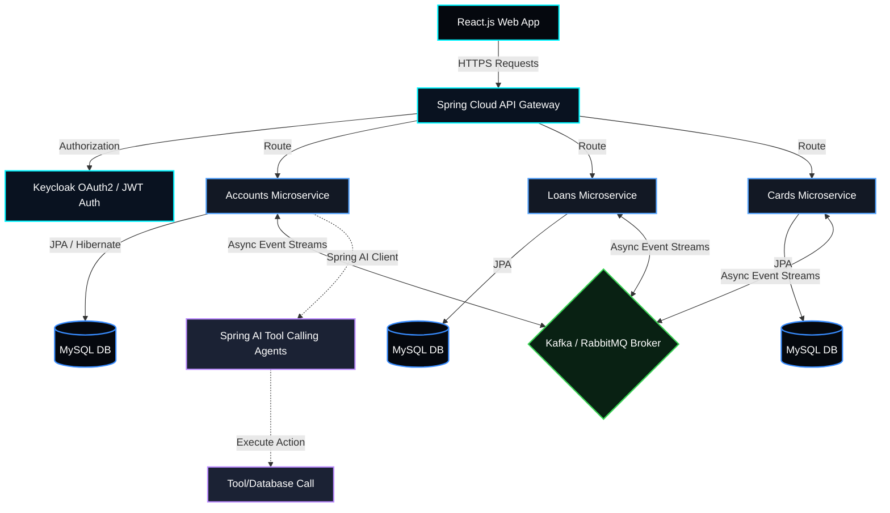

<div align="center">

<!-- Dynamic Capsule Header (Venom / Cyberpunk Deep Dark & Neon Blue Theme) -->


<!-- Animated Typing Banner (Focus on Java Jobs & Skills) -->
[](https://git.io/typing-svg)

<br/>

<!-- Connect Badges (Unified Cyan/Dark Badge Styling) -->
[](https://www.linkedin.com/in/eshant-yadav/)
[](https://github.com/yeshant1)
[](https://leetcode.com/u/yeshant1/)
[](mailto:eshant.yadav7017@gmail.com)

</div>


## 🖥️ System Status: Operational & Open for Collaboration

```diff
+ STATUS       : OPEN_FOR_HIRE
+ ROLE_FOCUS   : Java Full-Stack Developer | Backend Architect | Agentic AI Builder
+ PREFERENCE   : Distributed Microservices, DDD Monolith Migrations, Spring AI Orchestrators
+ LOCATION     : Pune, India (Open to Remote & Relocation)
+ INCOMING     : Listening for inquiries at eshant.yadav7017@gmail.com
```


## 💻 System Boot Sequence

```java
/**
 * Initializing EshantYadav runtime context...
 * Enterprise-grade settings loaded.
 */
public final class EshantYadav implements JavaDeveloper, AgenticAIBuilder {
    private static final Logger log = LoggerFactory.getLogger(EshantYadav.class);

    public static void main(String[] args) {
        log.info("Booting System Core...");
        
        var profile = SystemProfile.builder()
            .roles(List.of("Java Full-Stack Developer", "Agentic AI Architect"))
            .location("Pune, India (Open to Remote / Relocation)")
            .status(Status.ACTIVE_JOB_SEEKER_JAVA_ROLES)
            .experience("Capgemini Private Ltd, Pune")
            .build();
            
        log.info("System Ready. Listening for collaborations on port 8080 🚀");
    }
}
```


## 🧠 About Me

<table>
<tr>
<td width="50%" valign="top">

### 🏢 Professional Experience
- 💼 **Java Full-Stack Developer** @ **Capgemini, Pune** *(Jul 2025 – Present)*
- 🏗️ Orchestrated migrations from **legacy monoliths to clean DDD architecture**.
- 🤖 Deployed **Spring AI agents** with LLM tool-calling capabilities.
- 🔧 Reduced inter-module dependencies **~35%** (verified by SonarQube).

</td>
<td width="50%" valign="top">

### 🎓 Academic & Credentials
- 📚 **MCA** — Lovely Professional University *(CGPA: 7.9)*
- 🎓 **B.Sc. Computer Science** — Paliwal P.G. College
- 🥇 **GATE 2023 — AIR 1519** (Mathematics)
- ⭐ **5-Star HackerRank** in SQL
- ☁️ **AWS Certified Cloud Practitioner**

</td>
</tr>
</table>


## ⚙️ Tech Arsenal

<div align="center">

### ☕ Core Backend & Architecture


### 🤖 Generative AI & Agentic Workflows


### 🎨 Frontend & Visuals


### 🗄️ Databases, Cloud & DevOps


</div>


## 🎛️ Distributed Microservice Environment (Production Status)

```diff
+ [ONLINE] gateway-service   : 8080 | Eureka Routing, OAuth2 JWT Filter, AOP logging
+ [ONLINE] auth-service      : 8443 | Keycloak Identity provider, role authorization
+ [ONLINE] accounts-service  : 8081 | Spring AI Core, LLM Agentic Tool-calling, MySQL
+ [ONLINE] loans-service     : 8082 | Domain-driven calculations, credit aggregates
+ [ONLINE] cards-service     : 8083 | Kafka/RabbitMQ Consumer, asynchronous card issuer
```


## 🚀 Architectural Visualizations

Here is a system blueprint showing how my microservice architectures and GenAI integrations typically interact:




## 📂 Highlighted Projects

### 🏦 Microservices Banking System — *Production-Grade Distributed System*
> **Timeline:** `Jan 2026 – Apr 2026` &nbsp;|&nbsp; [**Repository →**](https://github.com/yeshant1)

A resilient, scalable banking ecosystem utilizing event-driven components and modern container orchestration.

- **Fault Tolerance:** Configured API Gateway, Eureka Service Discovery, and Resilience4j circuit breakers to guarantee **99.9% uptime**.
- **Security & Events:** Integrated Keycloak SSO with JWT token authorization; deployed Kafka/RabbitMQ brokers for high-throughput, async transactions.
- **Monitoring:** Leveraged Prometheus and Grafana for dashboard observability across services.

---

### 📚 AI-Powered E-Commerce Bookstore — *GenAI Orchestration*
> **Timeline:** `Sep 2025 – Dec 2025` &nbsp;|&nbsp; [**Repository →**](https://github.com/yeshant1)

An intelligent web catalog featuring automatic recommendations, support chatbot assistance, and real-time processing.

- **LLM Tool-Calling:** Programmed custom AI assistants with Spring AI, enabling dynamic responses to product listings, user support, and inventory queries.
- **Payment & Security:** Secured via JWT, handling transactions via Razorpay webhook configurations.


## 🤝 Let's Connect!

```bash
$ git clone https://github.com/yeshant1/contact.git && cd contact
$ ./connect.sh --channel all
```

```yaml
contact:
  email: eshant.yadav7017@gmail.com
  linkedin: linkedin.com/in/eshant-yadav
  hackerrank: hackerrank.com/profile/eshant_yadav7017
  leetcode: leetcode.com/u/yeshant1/
  availability: "READY_FOR_COMMERCIAL_PROJECTS"
```

<div align="center">
<br/>

</div>
