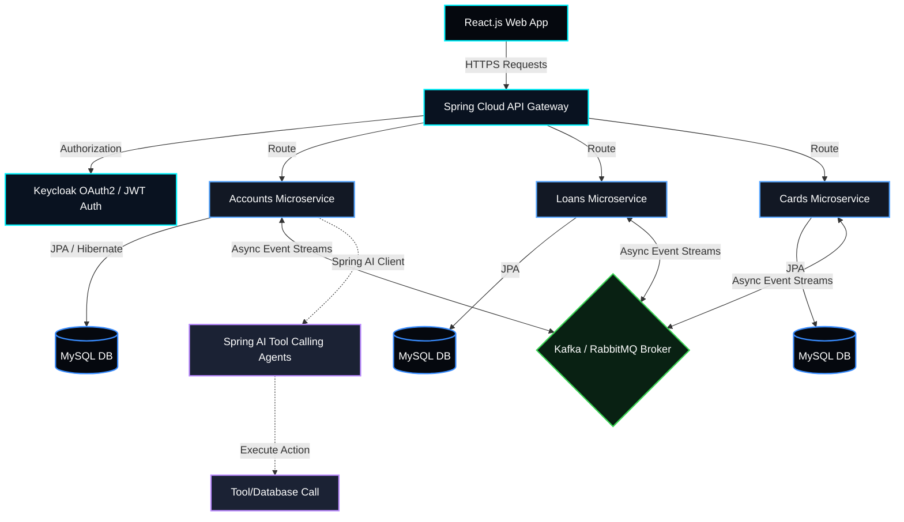
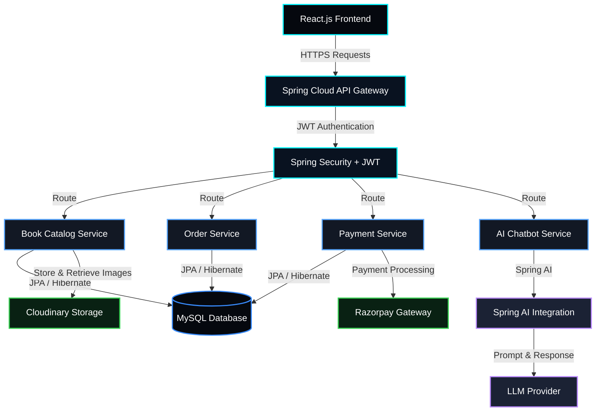

<div align="center">

<!-- Dynamic Capsule Header -->


[](https://git.io/typing-svg)

[](https://yeshant1.netlify.app/)

</div>

---

## 💻 System Boot Sequence

```java
/**
 * @author  Eshant Yadav
 * @company Capgemini Private Ltd, Pune
 * @role    Software Engineer
 * @version 2025.CURRENT
 */
public class EshantYadav implements BackendDeveloper, AgenticAILearner {

    private static final String[]  ROLES       = {
        "Java Backend Developer",
        "Agentic AI Learner",
        "Microservices Architect"
    };

    private static final String[]  STACK       = {
        "Java", "Spring Boot", "Spring Cloud", "Spring AI",
        "Microservices", "Domain-Driven Design", "React.js"
    };

    private static final String[]  WORKING_ON  = {
        "Legacy Modernization → Java Based Using DDD Architecture @ Capgemini",
        "Agentic AI Pipelines with LLM Tool-Calling & Spring AI",
        "Generative AI Integration into Spring Boot Microservices"
    };

    private static final String    LEARNING    = "System Design | Agentic AI | Spring AI Framework";
    private static final String    ACHIEVEMENT = "GATE 2023 AIR 1519 | AWS Certified | 5★ HackerRank SQL";
    private static final String    MOTTO       = "Engineering intelligence into every layer of the stack.";

    @Override
    public String getFunFact() {
        return "I build bridges between enterprise Java and the predictive power of AI 🚀";
    }
}
```

---

## 🧠 About Me

<table>
<tr>
<td width="50%">

**🏢 Professional**
- 💼 **Software Engineer Intern** @ **Capgemini, Bangalore** *(April 2025 – June 2026)*
- 💼 **Software Engineer** @ **Capgemini, Pune** *(Jul 2025 – Present)*
- 🏗️ Modernizing monolithic legacy apps → **Java Based Application Using DDD Architecture**
- 🤖 Building **Agentic AI pipelines** with LLM APIs + Spring AI
- 🔧 Refactored tightly coupled modules — improving maintainability & scalability

</td>
<td width="50%">

**🎓 Academic & Achievements**
- 📚 **MCA** — Lovely Professional University *(CGPA: 8/10)*
- 🎓 **B.Sc. Computer Science** — Paliwal P.G. College
- 🥇 **GATE 2023 — AIR 1519** (Mathematics)
- ⭐ **5-Star HackerRank** in SQL
- ☁️ **AWS Certified Cloud Practitioner** *(Dec 2025)*

</td>
</tr>
</table>

---

## ⚙️ Tech Arsenal

### ☕ Java Backend — *Core Expertise*


> **Patterns & Concepts:** Microservices · Domain-Driven Design (DDD) · RESTful APIs · AOP · Circuit Breaker · Event-Driven Architecture · Bounded Contexts · Aggregates · Anti-Corruption Layers

---

### 🤖 AI / GenAI / Agentic AI — *Actively Building*


> **Capabilities:** Agentic AI Pipelines · Multi-step LLM Reasoning · Tool-Calling via MCP · AI Chatbots · Document Summarization · Context-Aware Q&A · RAG · Prompt Engineering · LangFuse Observability

---

### 🎨 Frontend Development


---

### 🗄️ Databases · Messaging · Monitoring


---

### ☁️ DevOps · Cloud · Security


---

### 🔧 API · Tools · Practices


> **Practices:** Agile · Code Reviews · Unit Testing (JUnit 5) · Debugging · Domain Modeling · API-First Design · OpenTelemetry · Structured Logging

---

## 🚀 Featured Projects

### 🏦 Microservices Banking Application — *Personal Project*
> `Jan 2026 – Apr 2026` &nbsp;|&nbsp; [`View Repository →`](https://github.com/yeshant1)

A scalable, secure, event-driven banking platform built using **Spring Cloud** ecosystem and **Domain-Driven Design** principles.



| Metric | Result |
|---|---|
| 🏗️ **Architecture** | 3 independent Microservices — Accounts, Loans, Cards |
| 🔐 **Security** | OAuth2 + JWT + Keycloak — role-based access across all 3 services |
| 📊 **Observability** | Prometheus + Grafana — real-time service health dashboards |
| 📄 **API Coverage** | **20+ RESTful APIs** — Swagger (OpenAPI) + full Postman test suite |
| 📨 **Messaging** | RabbitMQ + Kafka for async event-driven inter-service communication |
| 🔁 **Resilience** | Circuit-breaker patterns for fault-tolerant service communication |
| 🚀 **Deployment** | Docker + Docker Compose for containerized deployments |

**Tech Stack:**
`Java` `Spring Boot` `Spring Cloud` `Spring Security` `Eureka` `API Gateway` `Kafka` `RabbitMQ` `Docker` `MySQL` `JWT` `OAuth2` `Keycloak` `Prometheus` `Grafana` `Swagger`

---

### 📚 AI-Powered E-Commerce Bookstore — *Full-Stack Application*
> `Sep 2025 – Dec 2025` &nbsp;|&nbsp; [`View Repository →`](https://github.com/yeshant1)

A full-stack, AI-integrated book marketplace featuring real-time payments, intelligent chatbot support, and role-based management — built using microservices architecture.



| Metric | Result |
|---|---|
| 💳 **Payments** | Razorpay — real-time payment processing & transaction management |
| 🤖 **AI Feature** | Spring AI chatbot — automated support responses |
| 👥 **Role System** | Admin · User · Purchase Master — 3 distinct dashboards with CRUD |
| 📄 **API Coverage** | **15+ RESTful APIs** — Swagger documented + full Postman validation |
| 🔐 **Security** | JWT-secured microservices with Spring Security |
| 🖼️ **Media** | Cloudinary integration for book thumbnail storage & delivery |

**Tech Stack:**
`Java` `Spring Boot` `Spring AI` `Spring Security` `React.js` `MySQL` `JWT` `Microservices` `Razorpay` `Cloudinary` `Swagger` `Postman`

---

---

### 🎓 Quiz Application — *Internship Project @ Capgemini*
> `Apr 2025 – Jun 2025` &nbsp;|&nbsp; *Software Engineer Intern — Capgemini Technology Services, Bangalore* &nbsp;|&nbsp; [`View Repository →`]([https://github.com/yeshant1](https://github.com/yeshant1/Quiz_App))

A microservices-based Quiz platform built during internship with secure REST APIs, real-time leaderboard, and payment integration.

| What | Detail |
|---|---|
| 🏗️ **Architecture** | 5 Microservices — Authentication, Question, Quiz, Leaderboard, Payment |
| 🔐 **Security** | Spring Security + API Gateway + Netflix Eureka for routing & service discovery |
| 🎯 **Features** | Complete CRUD for quiz/question management, real-time leaderboard, premium quiz payments |
| 🔧 **Cross-Cutting** | Spring AOP for cross-cutting concerns |
| 🎨 **Frontend** | Responsive UI using HTML & CSS |

**Tech Stack:**
`Java` `Spring Boot` `Spring Security` `Spring Cloud` `API Gateway` `Netflix Eureka` `Spring AOP` `MySQL` `HTML` `CSS`

---

### 🏢 Legacy Modernization — *Java Based Enterprise DDD Migration @ Capgemini*
> `Jul 2025 – Present` &nbsp;|&nbsp; *Professional Work — Capgemini, Pune*

Driving the architectural transformation of a monolithic enterprise system into java based application through a clean, domain-aligned modular architecture by using Domain-Driven Design (DDD) Principles.

| What | Impact |
|---|---|
| 🏗️ **DDD Implementation** | Defined bounded contexts, aggregates, entities & value objects aligning code to business domains |
| ✂️ **Refactoring** | Tightly coupled legacy modules → modular services with improved maintainability & scalability |
| 🛡️ **Anti-Corruption Layers** | Isolated legacy integrations — enabling incremental migration without disrupting production |
| 🤝 **Cross-Team Collaboration** | Partnered with UI/UX, Product, BA and QA teams to deliver features in Agile sprints |
| 🤖 **GenAI Integration** | Built AI features using Spring AI, LangChain & LLMs — chatbots, doc summarization, Q&A |
| 🔬 **AI Observability** | LangFuse + structured logging + tracing to monitor response quality & tool usage |

---

## 🏆 Achievements · Certifications

```
╔═══════════════════════════════════════════════════════════════╗
║                  CREDENTIALS & ACHIEVEMENTS                   ║
╠═══════════════════════════════════════════════════════════════╣
║  🥇  GATE 2023 — AIR 1519  (Score: 357, Mathematics)         ║
║  ⭐  5-Star HackerRank — SQL                                  ║
╠═══════════════════════════════════════════════════════════════╣
║  ☁️  AWS Certified Cloud Practitioner         Dec 2025        ║
╚═══════════════════════════════════════════════════════════════╝
```

---

## 🤝 Let's Collaborate On

```
> Java Backend & Microservices projects
> Integrating LLM agents & GenAI into Java/Spring Boot backends
> Cloud-native microservices & distributed systems design
> Agentic AI workflows with MCP & tool-calling
```

---

## 📫 Connect With Me

<div align="center">

[](https://yeshant1.netlify.app/)
[](https://www.linkedin.com/in/eshant-yadav/)
[](https://github.com/yeshant1)
[](mailto:eshant.yadav7017@gmail.com)
[](https://www.hackerrank.com/profile/eshant_yadav7017)
[](https://leetcode.com/u/yeshant1/)

<br/>

*"Engineering intelligence into every layer of the stack — from Spring Boot microservices to Agentic AI pipelines."*


</div>
